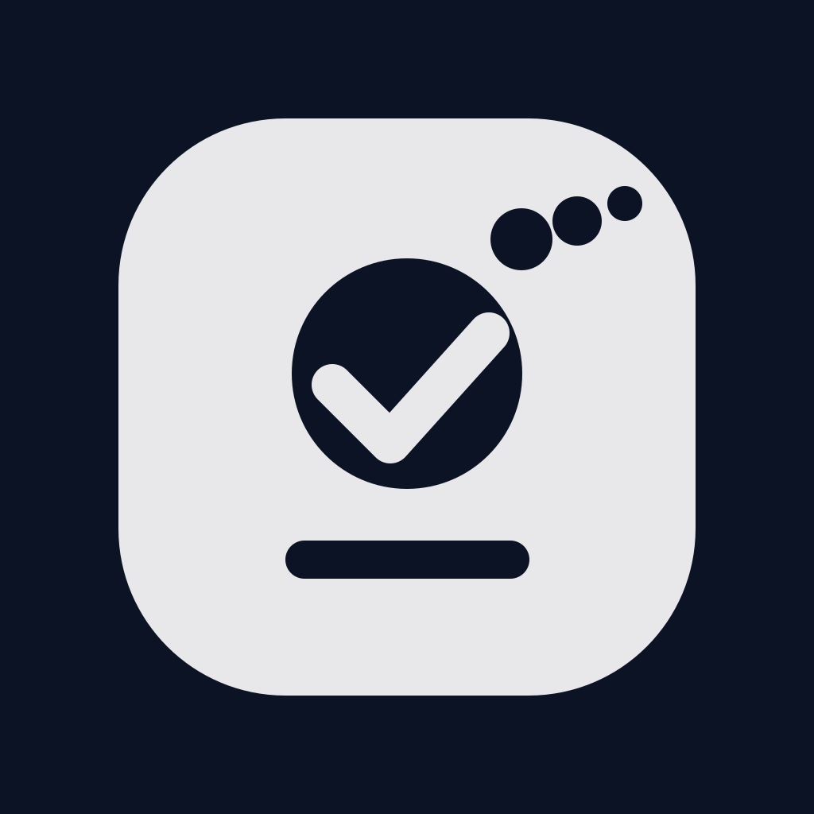

<p align="center">
  
</p>

<h1 align="center">Nudge List</h1>

<p align="center">
  <strong>Remember the little things.</strong>
</p>

<p align="center">
  A lightweight reminder app for <strong>iPhone</strong> and <strong>Mac</strong>.<br>
  Fast, native, local-first, and intentionally simple.
</p>

<p align="center">
  
  
  
  
  
  
</p>

---

## Why Nudge List?

Most reminder apps become too much.

Nudge List goes the opposite direction.

It is made for the quick things you do not want to forget:

- Bring charger
- Call Mom
- Return library book
- Buy dog food
- Pack passport
- Cancel subscription

Open the app, add the thought, set a reminder if you need one, and move on.

> **Add it. Nudge it. Done.**

---

## Features

- Fast nudge creation
- Optional note for extra context
- Optional reminder date and time
- Native Apple notifications
- Active and completed views
- Edit, complete, reopen, and delete nudges
- Shared SwiftUI codebase for iPhone and Mac
- Local-first storage with SwiftData
- Designed for iCloud / CloudKit sync
- No separate backend required for the core app

---

## Platforms

| Platform | Minimum Version |
| --- | --- |
| iPhone | iOS 17.0 |
| Mac | macOS 14.0 |

---

## Tech Stack

| Layer | Technology |
| --- | --- |
| Language | Swift |
| UI | SwiftUI |
| Persistence | SwiftData |
| Notifications | UserNotifications |
| Sync | CloudKit / iCloud |
| Project Generation | XcodeGen |
| Testing | XCTest / XCUITest |

---

## Project Structure

```text
NudgList/
├── NudgeList/
│   ├── App/
│   ├── Models/
│   ├── Services/
│   ├── Utilities/
│   ├── Views/
│   └── Resources/
├── NudgeListTests/
├── NudgeListUITests/
├── scripts/
├── project.yml
└── README.md
